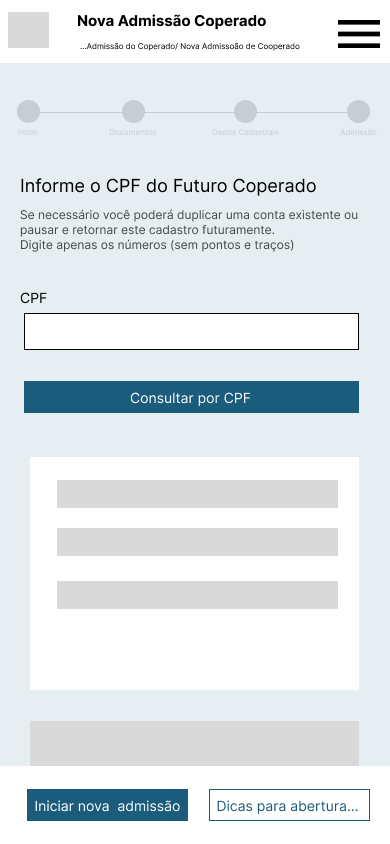
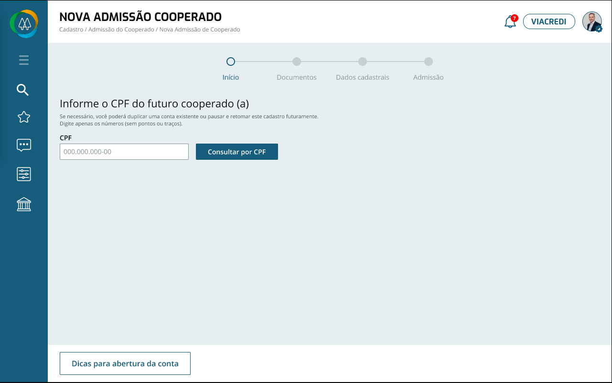

# AilosChallenge

## Design
### Mobile

### Desktop

## Guide

### Mock Server
  * open database folder in command line
  * run "json-server --watch db.json" in command line

Now you can check the mock server runing on ['localhost:3000'](http://localhost:3000) 

### Launch Application
  * run "npm install"
  * run "npm start"

After lauching the app you are good to test it.

